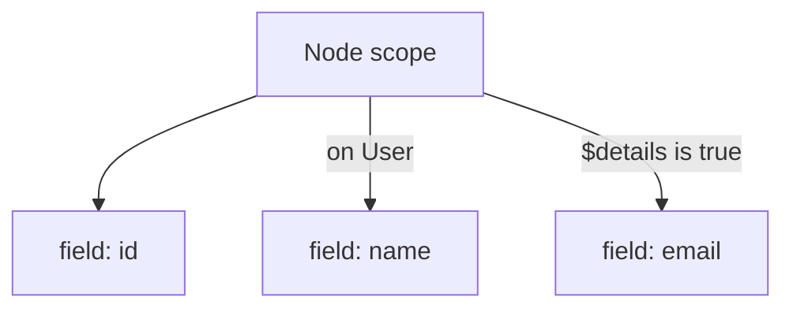

<!-- cspell:words componentwise Formedness GraphQL GraphQL's graphql graphql-lean graphql-static-analysis mathit mathrm operatorname overcounting preorder println sizedFields supergraph undercount undercounting -->

Several GraphQL implementations support the
[IBM `@cost` directive](https://ibm.github.io/graphql-specs/cost-spec.html) or a
similar cost control. They use a static estimate to reject queries whose cost
exceeds a configured limit. How hard could that be?

## What should this query cost?

```graphql
query Example1 {
  featured {
    ... on Media { title }
    ... on Book { title pageCount }
    ... on Film { duration }
  }
}
```

Suppose the schema defines these costs:

```graphql
interface Media {
  title: String
}

type Book implements Media {
  title: String @cost(weight: "2")
  pageCount: Int @cost(weight: "4")
}

type Film implements Media {
  title: String @cost(weight: "2")
  duration: Int @cost(weight: "9")
}

type Query {
  featured: Media
}
```

A naive analyzer can either overcount or undercount.

Adding every spread independently double-counts `title` and combines the
mutually exclusive object-type spreads:

$$
1 + 2 + (2 + 4) + 9 = 18
$$

Treating all three spread conditions as alternatives instead misses that
`Media.title` and `Film.duration` can happen together:

$$
1 + \max(2, 2 + 4, 9) = 10
$$

The first result, `18`, is unnecessarily restrictive. The second result, `10`,
is unsound.

There are only two runtime cases:

| Runtime type | Active selections | Collected field cost |
| --- | --- | ---: |
| `Book` | `Media.title`, `Book.title`, and `pageCount` | `1 + 2 + 4 = 7` |
| `Film` | `Media.title` and `duration` | `1 + 2 + 9 = 12` |

This computation touches three different relationships:

1. In the `Book` case, `Media.title` and `Book.title` have the same response name
   and resolver call. GraphQL merges them into one field group, so `title` costs
   `2`, not `4`.
2. In the `Film` case, `Media.title` and `Film.duration` have different
   conditions but are active together. Their costs must be combined.
3. `Book.pageCount` and `Film.duration` are mutually exclusive. Their costs must
   never be added to the same runtime case.

The complete bound is therefore:

$$
\begin{aligned}
\operatorname{featured} + \max(\text{Book case}, \text{Film case})
  &= 1 + \max(2 + 4, 2 + 9) \\
  &= 1 + 11 \\
  &= 12
\end{aligned}
$$

This small query captures the central problem of GraphQL static analysis: a
query represents a family of possible response shapes, selected by runtime
object types and query variables.

This is not an isolated corner case. The same questions recur in authorization,
policy enforcement, and other analyses of GraphQL operations. I use the IBM
cost model to show where current analyzers lose precision, then present a
reusable verified framework in `graphql-lean` and its practical Rust port.

## IBM static cost as an end-to-end case study

The [IBM GraphQL Cost Directives specification](https://ibm.github.io/graphql-specs/cost-spec.html)
is a useful stress test because its result depends on nearly every part of
GraphQL query analysis. It assigns schema weights through `@cost`, derives list
bounds through `@listSize`, and reports type and field costs separately.

### What the cost analysis computes

The IBM specification reports two independent quantities:

| Metric | What contributes to it |
| --- | --- |
| **Field cost** | Selected fields, using their configured weights and list multipliers |
| **Type cost** | Object values that may appear in the response, using their configured weights |

Consider its baseline example:

```graphql
query {
  users(max: 5) {
    age
  }
}
```

Suppose `users` has the default composite-field weight `1`, `age` has weight
`2`, and both `Query` and `User` have the default type weight `1`. The
argument `max: 5` tells the analysis to allow for as many as five returned
users.

The static estimate therefore assumes the largest permitted response:

$$
\begin{aligned}
\text{field cost} &= \operatorname{users} + 5 \cdot \operatorname{age}
                   = 1 + 5 \cdot 2 = 11, \\
\text{type cost}  &= \mathrm{Query} + 5 \cdot \mathrm{User}
                   = 1 + 5 \cdot 1 = 6.
\end{aligned}
$$

If the resolver actually returns only three users, the concrete response costs
less:

$$
\begin{aligned}
\text{field cost} &= \operatorname{users} + 3 \cdot \operatorname{age}
                   = 1 + 3 \cdot 2 = 7, \\
\text{type cost}  &= \mathrm{Query} + 3 \cdot \mathrm{User}
                   = 1 + 3 \cdot 1 = 4.
\end{aligned}
$$

Static analysis does not try to predict that the resolver will return three
users. Its job is to compute a field cost of `11` and a type cost of `6`: safe
bounds on any response that respects the declared list limit. The response-side
calculation then measures field cost `7` and type cost `4` for the value that was
actually produced.

An ideal IBM analysis must also handle:

- schema, operation, argument, and nested input-object defaults;
- slicing arguments, assumed list sizes, and `sizedFields` propagation;
- supplied variables and GraphQL's
  [`@skip` and `@include` directives](https://spec.graphql.org/September2025/#sec--skip);
- [possible concrete object types](https://spec.graphql.org/September2025/#sec-Interfaces)
  for interfaces and unions;
- aliases and response-name field collection; and
- signed type, argument, and input-field weights.

The list-size premise matters: an estimate based on a list size of `5` is valid
only when the resolver returns no more than five items.

### Six studied cases

I compared five current analyzers with six focused cases.
[Hot Chocolate](https://github.com/ChilliCream/graphql-platform) reports IBM's
separate type and field costs.
[Apollo Router](https://github.com/apollographql/router),
[Hive Router](https://github.com/graphql-hive/router), and
[Cosmo Router](https://github.com/wundergraph/cosmo) report one router-specific
demand-control score. For
[`graphql-query-complexity`](https://github.com/slicknode/graphql-query-complexity),
I supplied an IBM-like custom estimator through its public API. Those numbers
are not interchangeable, so each implementation is compared with the ideal
result in its own metric.

The custom estimator tests the analysis framework's treatment of GraphQL
conditions and fields. It is not a claim that `graphql-query-complexity` has
built-in support for IBM directives.

The cases ask whether an analyzer handles six pieces of GraphQL semantics.
Together, they explain the precision families summarized at the end.

#### Case 1: Mutually exclusive object types

Two object-type conditions cannot apply to the same runtime value:

```graphql
query {
  result {
    ... on A { a }
    ... on B { b }
  }
}
```

If `a` costs `10` and `b` costs `20`, no runtime value can select both. Including
the root field, the ideal IBM result is type/field `2/21`; the ideal router score
is `21`.

- Hot Chocolate returned `2/21`; Cosmo and `graphql-query-complexity` returned
  `21`. All three results are ideal in their respective metrics.
- Apollo and Hive combined the mutually exclusive branches and returned `31`.

This case distinguishes feasible runtime-type reasoning from simply adding
every fragment in the document.

#### Case 2: A supplied list-size variable

The next case combines the same exclusive branches with a query variable:

```graphql
query Test($n: Int!) {
  results(limit: $n) {
    ... on A { a }
    ... on B { b }
  }
}
```

Suppose `results` costs `1`, `a` costs `10`, and `b` costs `20`. With
`{ "n": 4 }`, the query should have the same result as writing `limit: 4`.
Only one object branch can apply, so the ideal IBM result is type/field `5/81`:

$$
\begin{aligned}
\text{field cost} &= \operatorname{results} + 4 \cdot \max(a, b)
                   = 1 + 4 \cdot 20 = 81, \\
\text{type cost}  &= \mathrm{Query} + 4 \text{ returned objects}
                   = 1 + 4 = 5.
\end{aligned}
$$

The equivalent ideal router score is $4(1 + 20) = 84$; that metric counts
the returned composite-field branch inside the list multiplier.

- Hot Chocolate returned `2/21`, the size-one result. Its tested entry point did
  not use `$n` for `@listSize`.
- Apollo and Hive did use `$n`, but also combined `a` and `b`, returning `124`.
- Cosmo used the variable and handled the exclusive branches, returning the
  ideal `84`.
- `graphql-query-complexity` also used `$n` and took the maximum concrete-type
  branch, returning `84`.

This one query tests two independent capabilities: using supplied variables and
preserving feasible runtime-type cases.

#### Case 3: Complementary Boolean directives

One Boolean variable can make two selections mutually exclusive even when they
appear in different parts of a query:

```graphql
query Example($x: Boolean!) {
  left {
    costly @include(if: $x)
  }
  right {
    costly @skip(if: $x)
  }
}
```

Exactly one weight-`10` field is active for either value of `$x`. The ideal IBM
result is type/field `3/12`; the ideal router score is `12`: two parent fields
plus one expensive child.

- Hot Chocolate returned `3/22`, and Apollo returned `22`; both charged the two
  expensive fields.
- Hive, Cosmo, and `graphql-query-complexity` used the supplied Boolean value and
  returned the ideal `12`.

This case checks whether the analysis handles one shared variable assignment
across sibling selection sets.

#### Case 4: A duplicate response name across fragments

GraphQL groups fields by response name, even when duplicates come from separate
fragments:

```graphql
query {
  result {
    ... on A { label: a }
    ... on A { label: a }
  }
}
```

If `a` costs `10`, the resolver for `label` runs once. The ideal IBM result is
type/field `2/11`; the ideal router score is `11`.

- Hot Chocolate, Hive, and Cosmo returned the ideal result.
- Apollo's query-planned cost also returned `11`. Its direct supergraph
  calculator returned `21`, illustrating why the entry point matters.
- `graphql-query-complexity` returned `21`: it evaluated both syntactic
  occurrences instead of collecting the shared response name.

This case isolates response-name collection from runtime-type and variable
reasoning.

#### Case 5: Signed weights and merged child selections

Duplicate counting is usually conservative only because costs are nonnegative.
The [IBM specification](https://ibm.github.io/graphql-specs/cost-spec.html)
allows signed type weights, which reverses that intuition.

Consider this schema:

```graphql
scalar Text @cost(weight: "5")

type Query @cost(weight: "0") {
  book: Book
}

type Book @cost(weight: "-7") {
  title: Text
  author: Author
}

type Author {
  name: Text
}
```

**(Test query)** Now select two conditional pieces of the same `book` response
field:

```graphql
query Example($a: Boolean!, $b: Boolean!) {
  book @include(if: $a) {
    title
  }
  book @include(if: $b) {
    author { name }
  }
}
```

**(Merged control query)** With both variables true, GraphQL field collection
makes it equivalent to:

```graphql
query {
  book {
    title
    author { name }
  }
}
```

The merged type contribution is:

$$
\begin{aligned}
\mathrm{Book} + \mathrm{Text} + \mathrm{Author} + \mathrm{Text}
  &= -7 + 5 + 1 + 5 \\
  &= 4.
\end{aligned}
$$

Analyzing the two `book` occurrences independently duplicates the negative
`Book` weight. The test query and already-merged query should have the same
result in either metric:

| Metric | Ideal result |
| --- | ---: |
| IBM type/field cost | `4/2` |
| Router score | `4` |

Several analyzers disagreed:

| Implementation | Test query | Merged control |
| --- | ---: | ---: |
| Hot Chocolate 16.6.2 | `-2/1` | `4/2` |
| Apollo Router 2.17.0 source calculator | `-3` | `4` |
| Hive Gateway 2.10.7 | `-3` | `4` |
| Cosmo Router 0.343.1 | `4` | `4` |
| `graphql-query-complexity` 2.0.0 with the custom estimator | `0` | `4` |

Numbers across rows use different metrics and should not be compared to each
other. The relevant comparison is horizontal: each implementation's split
query against its own merged control.

With negative weights, a seemingly conservative overcount becomes an unsafe
underestimate. An ideal analysis must collect the complete response field before
applying its signed costs.

#### Case 6: A zero-length list

A supplied list bound of zero should not be silently raised to one. Consider a
field whose returned `Item` has the default type weight `1` and whose `value`
field costs `3`:

```graphql
query Zero($n: Int!) {
  items(limit: $n) { value }
}
```

With `{ "n": 0 }`, the largest permitted list is empty. The ideal IBM result is
type/field `1/1`: the root `Query` value and the call to `items` remain, but no
`Item` or `value` contribution is multiplied into the result. The ideal router
score is `0`.

- Hive and `graphql-query-complexity` returned the ideal router score `0`.
- Apollo Router 2.17.0's source calculator also evaluates the zero multiplier
  to `0`.
- Hot Chocolate returned type/field `2/4`, effectively charging one item.
- Cosmo returned `4`, also the one-item score of `1 + 3`.

The Hot Chocolate and Cosmo results are safe overestimates, not unsafe
underestimates. They can reject a query that fits the limit, but won't admit a
query whose cost exceeds the estimate.

### Precision families at a glance

The six cases now give each implementation a compact precision score. A check
means that the tested entry point matched the ideal result in its own metric; a
dash means that it did not match or did not produce a result.

| Implementation | C1 | C2 | C3 | C4 | C5 | C6 | Score |
| --- | :---: | :---: | :---: | :---: | :---: | :---: | ---: |
| Hot Chocolate 16.6.2 | ✓ | — | — | ✓ | — | — | **2/6** |
| Apollo Router 2.17.0 | — | — | — | ✓ | — | ✓ | **2/6** |
| Hive Router 0.2.2 | — | — | ✓ | ✓ | — | ✓ | **3/6** |
| Cosmo Router 0.343.1 | ✓ | ✓ | ✓ | ✓ | ✓ | — | **5/6** |
| `graphql-query-complexity` 2.0.0 | ✓ | ✓ | ✓ | — | — | ✓ | **4/6** |

`C1` through `C6` refer to the numbered cases above.

The score makes four broad precision families visible:

- **Feasible cases with response-name collection:** Cosmo matched five cases,
  including signed field merging, but rounded the zero list to one item.
- **Concrete-type and variable aware:** `graphql-query-complexity` matched four
  cases. It handled runtime-type alternatives and request variables, but did
  not collect response names before applying the custom estimator.
- **Partially refined:** Hot Chocolate and Hive succeeded in complementary
  areas. Hot Chocolate handled concrete runtime types; Hive handled supplied
  variables, including zero. Both collected the ordinary duplicate.
- **Mostly structural:** Apollo matched the duplicate after query planning and
  preserved zero, but combined mutually exclusive type branches.

The score is not a general conformance grade. It summarizes six deliberately
focused cases, and equal scores do not imply identical algorithms. Hive Router
also rejected the signed schema; the `-3` observation above came from Hive
[Gateway Runtime 2.10.7](https://github.com/graphql-hive/gateway).

## Static analysis must reason about possible executions

The implementation results show that static query analysis is harder than it
first appears. A static analysis computes a property without running resolvers,
but it must still account for every feasible execution.

Two qualities matter:

- **Soundness:** every concrete execution must be bounded by the analysis.
- **Precision:** the bound should not include combinations that cannot execute
  together.

Underestimation is a correctness failure: an operation can pass admission even
though its execution exceeds the reported limit. Overestimation is safe, but it
can reject useful operations that actually fit within the limit.

Variables can also interact with nested list sizes:

```graphql
query Feed($first: Int!, $withComments: Boolean!) {
  stories(first: $first) {
    title
    comments(first: 5) @include(if: $withComments) {
      body
    }
  }
}
```

The cost of `title` is multiplied by the requested number of stories. The cost
of `body` is multiplied again by the comment bound, but only when
`$withComments` is true. An analysis with variable values assigned can use the
coerced value of `$first` and remove the comments branch when the supplied
Boolean is false. A symbolic analysis without variable values needs an explicit
bound for `$first`.

Fragments add runtime-type conditions. Repeated response names invoke
[GraphQL field collection](https://spec.graphql.org/September2025/#sec-Field-Collection),
even when selections appear in distant fragments. Every nested composite field
starts the same problem again with its merged child selection set.

> A GraphQL analysis must not merely ask which selections occur in the
> document. It must ask which selections can execute together.

That semantic machinery is largely the same whether the result is a cost, a
maximum response size, or another property of the response. Reimplementing it
inside every analyzer invites the same subtle mistakes.

This motivated a reusable static-analysis framework in
[`graphql-lean`](https://github.com/duckki/graphql-lean). The framework handles
conditions, field collection, and recursive selection sets once. An individual
analysis supplies only a small algebra describing what each field contributes
and how results compose. Lean then connects that algebra to GraphQL execution
with reusable soundness and optimality theorems.

The IBM estimator is one application of the framework. Maximum response size
is another. The architecture underneath them is the main result.

## Analysis architecture

The framework separates GraphQL semantics from the property being analyzed.
It first extracts conditions from one selection-set scope, then traverses the
result by reasoning about overlapping branches, and finally presents only
collected fields to an analysis-specific algebra.

### Condition-tree preprocessing

The first phase extracts a
[*condition tree*](https://github.com/duckki/graphql-lean/blob/06a5d04d6c00b875d7da9c1c4f1c148b32191f0d/GraphQL/Theories/ConditionTree.lean#L420-L479)
from one validated selection-set scope. A node stores unconditional fields and
places conditional selections behind labeled edges.

This example has one leaf field and two kinds of condition edges. It also
repeats fields under identical conditions:

```graphql
query Example($details: Boolean!) {
  node {
    id

    ... on User { name }
    ... on User { name }

    email @include(if: $details)
    ... @include(if: $details) { email }
  }
}
```

The extracted scope has this shape:



The condition tree performs two useful canonicalizations before analysis:

- Fields guarded by the same type or Boolean condition share one branch. The
  two `User` fragments and the syntactically different `$details` selections do
  not create duplicate edges.
- Exact duplicate fields under the same condition are deduplicated. `name` and
  `email` therefore appear once in the extracted tree. Nested child selections
  remain available for field collection and merging.

Nested conditions share their common paths in the same way. Boolean edges retain
the variable name, ensuring that repeated uses of `$details` make one shared
choice rather than independent choices.

The Rust port implements the same preprocessing in
[`ConditionTree::extract`](https://github.com/duckki/graphql-static-analysis-rs/blob/f0da21cba289f196c729a62df796e492baf2f560/src/engine/condition_tree.rs#L59-L95).

### Traversing overlapping conditions

The traversal decides whether condition-tree branches can be active together.
If their conditions overlap, their fields must be grouped and their outcomes
combined. If their conditions are disjoint, their outcomes are computed
separately and not combined.

Consider a `Node` field whose possible object types overlap two abstract type
conditions:

| Object type | `Searchable` | `Reviewable` |
| --- | :---: | :---: |
| `Article` | yes | no |
| `Product` | yes | yes |
| `Review` | no | yes |
| `User` | no | no |

Now analyze this selection set:

```graphql
query {
  node {
    id
    ... on Searchable { title }
    ... on Reviewable { rating }
  }
}
```

The two interface conditions overlap on `Product`. They partition the possible
runtime types into four regions:

| Type region | Example objects | Active fields |
| --- | --- | --- |
| `Searchable` and `Reviewable` | `Product` | `id`, `title`, `rating` |
| `Searchable` only | `Article` | `id`, `title` |
| `Reviewable` only | `Review` | `id`, `rating` |
| Neither | `User` | `id` |

A precise analyzer can split over every concrete object type and compute one
outcome per type. That works, but its effort grows with the number of object
types—even when many types activate exactly the same selections.

The framework instead computes
[`possibleTypeRegions`](https://github.com/duckki/graphql-lean/blob/06a5d04d6c00b875d7da9c1c4f1c148b32191f0d/GraphQL/Theories/TreeSummary/Core.lean#L132-L149).
If the schema had 100 object types distributed among the same four membership
patterns, the query would still produce only these four analysis cases. The
Rust traversal performs the corresponding split in
[`partition_type_region`](https://github.com/duckki/graphql-static-analysis-rs/blob/f0da21cba289f196c729a62df796e492baf2f560/src/engine/exact_cases.rs#L329-L386).

This is the same idea used by the optimized checker in my previous post on
[query inclusion](#from-a-reference-checker-to-an-optimized-checker).
Think of possible runtime types as pixels on a screen and each abstract type
condition as an area drawn over it. The condition boundaries partition the
screen into regions. Every object type inside one region activates the same
selections, so the traversal processes the region once instead of checking
every pixel.

<figure class="type-region-figure">
  <picture>
    <source
      media="(max-width: 600px)"
      srcset="{{ '/assets/images/query-inclusion-type-regions-mobile.svg' | relative_url }}"
    >
    
  </picture>
  <figcaption>
    Two overlapping abstract type conditions form four regions. Region
    traversal retains object-by-object precision without repeating the same
    analysis for every concrete type in a region.
  </figcaption>
</figure>

The `Example1` query is the smaller two-region version of this idea:

$$
\begin{aligned}
\{\mathrm{Book}\} &\longmapsto
  \mathrm{Media.title} + \mathrm{Book.title} + \mathrm{Book.pageCount}, \\
\{\mathrm{Film}\} &\longmapsto
  \mathrm{Media.title} + \mathrm{Film.duration}.
\end{aligned}
$$

The `Book` region collects the two `title` occurrences into one call, then
combines its cost with `pageCount`: `2 + 4 = 6`. The `Film` region combines
`title` and `duration`: `2 + 9 = 11`. The regions are disjoint, so the traversal
keeps the larger alternative and adds the root field:

$$
1 + \max(2 + 4, 2 + 9) = 12
$$

Boolean conditions follow the same principle when variable values are not
supplied. A variable is decided only when the traversal reaches a relevant
branch, and one assignment is preserved across sibling fields and recursive
children.

### The analysis algebra

After making the overlap and grouping decisions, the engine exposes only fields
and abstract states to an individual analysis. The analysis supplies four
operations through
[`TreeSummary.Algebra`](https://github.com/duckki/graphql-lean/blob/06a5d04d6c00b875d7da9c1c4f1c148b32191f0d/GraphQL/Theories/TreeSummary/Core.lean#L150-L161):

```lean
structure Algebra where
  Summary : Type u
  empty : Summary
  field : CollectedFieldGroup -> Summary -> Summary
  combine : Summary -> Summary -> Summary
  join : Summary -> Summary -> Summary
```

| Operation | Meaning |
| --- | --- |
| `empty` | No selected response field contributes anything. |
| `field` | Summarize one collected response field after summarizing its merged children. |
| `combine` | Compose abstract states whose represented outcomes can happen together. |
| `join` | Bound states whose represented outcomes are disjoint alternatives. |

The engine—not the individual analysis—decides whether two branch outcomes must
be combined or joined. The analysis author provides only the meaning of those
operations.

A response-field-count analysis is almost trivial:

$$
\begin{aligned}
\operatorname{empty} &= 0, \\
\operatorname{field}({-}, \mathit{children}) &= 1 + \mathit{children}, \\
\operatorname{combine}(\mathit{left}, \mathit{right}) &= \mathit{left} + \mathit{right}, \\
\operatorname{join}(\mathit{left}, \mathit{right}) &= \max(\mathit{left}, \mathit{right}).
\end{aligned}
$$

This follows an abstract-interpretation-style design. Concrete executions are
approximated by abstract summaries. GraphQL context flows down through the
condition tree; summaries flow back up through the algebra.

## What Lean proves

The engine proves GraphQL traversal once; each analysis proves only its local
algebra. Its public
[`AnalysisWithVariablesSound`](https://github.com/duckki/graphql-lean/blob/06a5d04d6c00b875d7da9c1c4f1c148b32191f0d/GraphQL/Theories/TreeSummary/ExactCases.lean#L784-L800)
contract says exactly what the generic engine guarantees:

```lean
def AnalysisWithVariablesSound
    {concrete : ConcreteAlgebra.{u}}
    (algebraFor : VariableValues -> Algebra.{v}) {schema : Schema}
    (soundnessFor : ∀ values, Soundness concrete (algebraFor values) schema values)
    (operation : Operation)
    : Prop :=
  SchemaWellFormedness.schemaWellFormed schema
  -> Validation.operationDefinitionValid schema operation
  -> ∀ (ObjectRef : Type) (resolvers : Resolvers ObjectRef)
        (variableValues : VariableValues) (source : ResolverValue ObjectRef),
      let coercedVariableValues := Execution.coerceVariableValues operation variableValues
      (soundnessFor coercedVariableValues).approximates
        (foldAnnotatedResponse concrete
          (executeQueryAnnotated schema resolvers variableValues operation source))
        (summarizeOperationWithVariables algebraFor schema variableValues operation)
```

In other words, for every resolver implementation, variable input, and root
value, the static summary approximates the executed response.

The algebraic assumptions are smaller than their Lean encoding suggests. Let
$a ≼ b$ mean that $b$ is at least as conservative as $a$; let $0$, $⊗$, $⊔$,
and $F_g$ denote `empty`, `combine`, `join`, and the transfer for field `g`:

$$
\begin{aligned}
(a \otimes b) \otimes c &= a \otimes (b \otimes c), &
a \otimes b &= b \otimes a, &
0 \otimes a &= a, \\
a &\preceq a \sqcup b, &
b &\preceq a \sqcup b, \\
(a \sqcup b) \otimes c &\preceq (a \otimes c) \sqcup (b \otimes c), &
F_g(a \sqcup b) &\preceq F_g(a) \sqcup F_g(b).
\end{aligned}
$$

Together with the preorder, monotonicity, and concrete-transfer laws, these
equations let the engine regroup simultaneous work and factor alternatives
without losing soundness. The generic proof carries those local facts through
directives, type regions, response-name merging, and recursive selections.
Analogous [`best-transfer laws`](https://github.com/duckki/graphql-lean/blob/06a5d04d6c00b875d7da9c1c4f1c148b32191f0d/GraphQL/Theories/TreeSummary/ExactCasesOptimality.lean#L96-L120)
give the optimality result.

### The result for IBM cost

The IBM analysis's
[`algebra`](https://github.com/duckki/graphql-lean/blob/06a5d04d6c00b875d7da9c1c4f1c148b32191f0d/GraphQL/Theories/TreeSummary/StaticCost.lean#L499-L513)
uses pairs of type and field costs, componentwise addition for `combine`, and
componentwise maximum for `join`. After proving the local laws, the IBM analysis
obtains this domain-specific
[`AnalysisWithVariablesSound`](https://github.com/duckki/graphql-lean/blob/06a5d04d6c00b875d7da9c1c4f1c148b32191f0d/GraphQL/Theories/TreeSummary/StaticCost.lean#L736-L751)
statement:

```lean
def AnalysisWithVariablesSound (schema : Schema) (model : CostModel)
    (operation : Operation) : Prop :=
  SchemaWellFormedness.schemaWellFormed schema
  -> Validation.operationDefinitionValid schema operation
  -> ∀ (ObjectRef : Type) (resolvers : Execution.Resolvers ObjectRef)
        (variableValues : Execution.VariableValues)
        (source : Execution.ResolverValue ObjectRef),
      ResponseWithinEstimatedSizes schema model
        (executeQueryAnnotated schema resolvers variableValues operation source)
      -> actualCost schema model
            (executeQueryAnnotated schema resolvers variableValues operation source)
          ≤ estimateOperationWithVariables schema model variableValues operation
```

For every resolver implementation, variable assignment, and root source, the
actual response cost is at most the static estimate when the schema and
operation are valid and the response respects the list-size assumptions.

The statement evaluates an *annotated response*. As discussed in the
[query-inclusion post](#a-response-can-hide-which-resolver-ran),
ordinary JSON can hide which field resolver produced an aliased response key.
The annotations retain that information, while an
[`executeQueryAnnotated_toResponse`](https://github.com/duckki/graphql-lean/blob/06a5d04d6c00b875d7da9c1c4f1c148b32191f0d/Proofs/GraphQL/Theories/TreeSummary/AnnotationErasure.lean#L243-L250)
erasure theorem connects the result back to ordinary GraphQL execution. The
analogous
[`AnalysisWithVariablesOptimal`](https://github.com/duckki/graphql-lean/blob/06a5d04d6c00b875d7da9c1c4f1c148b32191f0d/GraphQL/Theories/TreeSummary/StaticCost.lean#L801-L810)
statement proves:

> The traversal adds no avoidable approximation beyond the analysis's own
> local model.

This is structural optimality over the modeled outcomes. It does not assert that
every modeled outcome is realizable by some resolver; it says the engine
computes the best bound expressible within the analysis model.

The bottom line is that both implementations reach all six ideal results
introduced earlier. The scorecard uses the same columns as the implementation
comparison:

| Implementation | C1 | C2 | C3 | C4 | C5 | C6 | Score |
| --- | :---: | :---: | :---: | :---: | :---: | :---: | ---: |
| `graphql-lean` | ✓ | ✓ | ✓ | ✓ | ✓ | ✓ | **6/6** |
| Rust port | ✓ | ✓ | ✓ | ✓ | ✓ | ✓ | **6/6** |

These examples do not constitute the proof—the Lean theorems quantify over all
modeled inputs. They make the consequences of those theorems concrete and show
that the separate Rust port preserves the same outcomes in the study.

## From the verified blueprint to a practical Rust engine

The Lean formalization and production-oriented implementation live in separate
repositories. [`graphql-lean`](https://github.com/duckki/graphql-lean) is the
executable blueprint and proof artifact.
[`graphql-static-analysis`](https://github.com/duckki/graphql-static-analysis-rs)
is an [MIT-licensed](https://github.com/duckki/graphql-static-analysis-rs/blob/main/LICENSE)
Rust crate. Its reusable
[`Analyzer`](https://github.com/duckki/graphql-static-analysis-rs/blob/f0da21cba289f196c729a62df796e492baf2f560/src/engine/mod.rs#L136-L228)
operates over
[`apollo-compiler`](https://github.com/apollographql/apollo-rs/tree/main/crates/apollo-compiler)
schemas and validated operations.

The
[`CostEstimator`](https://github.com/duckki/graphql-static-analysis-rs/blob/f0da21cba289f196c729a62df796e492baf2f560/src/analyses/cost/estimator.rs#L27-L97)
has a small API. Here's an example usage:

```rust
use graphql_static_analysis::cost::{CostEstimator, CostModel};

let model = CostModel::from_schema(&schema)?;
let estimator = CostEstimator::new(model)
    .default_list_size(100);

let cost = estimator.estimate(&document, operation, &variables)?;
println!("type cost: {}", cost.type_cost);
println!("field cost: {}", cost.field_cost);
```

The Rust source is not formally verified. Instead, its
[differential-fuzzing setup](https://github.com/duckki/graphql-static-analysis-rs/blob/main/docs/fuzzing.md)
builds a native executable from `graphql-lean` and uses it as an oracle. The
current deterministic profile covers 15,840 cases across response size,
feasible condition cases, recursively collected-field traces, and IBM cost. The
Rust results agree with the pinned Lean model throughout that bounded profile.
Coverage-guided fuzzing exercises the same oracle protocol.

That is strong evidence that the separate implementation follows the verified
blueprint. It is not a universal proof of Rust equivalence.

### Performance in context

The [benchmark study](https://github.com/duckki/graphql-static-analysis-rs/blob/main/docs/performance-benchmark.md)
found that the closest like-for-like public comparison was
`graphql-query-complexity`: both analyzers receive parsed and validated GraphQL
artifacts, use supplied variables, and reason about possible object types. The
Rust engine also performs response-name collection and the more involved IBM
type/field algebra.

| Benchmark endpoint | `graphql-query-complexity` | Rust engine | Rust speed-up |
| --- | ---: | ---: | ---: |
| 1,024 objects, 8 abstract spreads | `76.3 µs` | `29.0 µs` | `2.63×` |
| 1,024 objects, 80 abstract spreads | `666.0 µs` | `257.5 µs` | `2.59×` |
| 10,240 objects, 8 abstract spreads | `555.2 µs` | `242.3 µs` | `2.29×` |

The Rust engine was faster at these recorded endpoints while preserving
response-name collection that the comparison library did not.

The concrete-runtime-type-precise implementations provide additional context:

| Implementation | Schema scale: 1,024→10,240 objects | Query scale: 8→80 spreads |
| --- | ---: | ---: |
| Rust engine | `29.2→242.3 µs` (`8.30×`) | `29.0→257.5 µs` (`8.88×`) |
| Hot Chocolate 16.6.2 | `246→2,357 µs` (`9.58×`) | `247→2,673 µs` (`10.82×`) |
| Cosmo core (`graphql-go-tools` 2.18.0) | `14.4→157.9 µs` (`10.98×`) | `14.4→67.1 µs` (`4.66×`) |

The fine print matters:

- The scale factors compare each implementation with itself; they are not
  cross-language speed ratios.
- The Rust timings begin with parsed and validated input. They include condition
  processing, type-region traversal, and field grouping.
- Hot Chocolate includes request and validation work that the Rust row excludes.
- Cosmo starts from an already variable-reduced and grouped cost tree. Its scale
  factor is similar or better, but the preprocessing done by the Rust engine is
  outside the timed Cosmo fold.

The tables are therefore not a universal speed leaderboard. They show that the
verified-model-derived Rust implementation is fast enough to be practical while
performing the GraphQL reasoning required for the ideal results.

## Build your own analysis

Static cost is an example, not a hard-coded purpose of the framework.

The Rust crate's maximum-response-size estimator shows how little
analysis-specific code is needed. Its implementation is centered on this
[`Algebra` instance](https://github.com/duckki/graphql-static-analysis-rs/blob/f0da21cba289f196c729a62df796e492baf2f560/src/analyses/max_response_size.rs#L91-L117):

```rust
struct MaxResponseSizeAlgebra<'schema> {
    schema: &'schema Schema,
    list_size: u64,
}

impl Algebra for MaxResponseSizeAlgebra<'_> {
    type Summary = u64;

    fn empty(&self) -> Self::Summary {
        0
    }

    fn field(
        &self,
        group: &CollectedFieldGroup,
        child_summary: Self::Summary,
    ) -> Self::Summary {
        1_u64.saturating_add(
            self.field_list_multiplier(group)
                .saturating_mul(child_summary),
        )
    }

    fn combine(&self, left: Self::Summary, right: Self::Summary) -> Self::Summary {
        left.saturating_add(right)
    }

    fn join(&self, left: Self::Summary, right: Self::Summary) -> Self::Summary {
        left.max(right)
    }
}
```

The summary is a single `u64`. Each collected response field contributes one;
each list layer multiplies its completed children by the configured list bound.
Fields that can occur together are added, while mutually exclusive outcomes are
joined with `max`. Saturating arithmetic makes the finite Rust representation
conservative at overflow. `MaxResponseSizeEstimator` passes this
algebra to the shared engine.

A custom analysis follows the same recipe:

1. Choose a summary domain and an order meaning "at least as conservative."
2. Implement `empty`, `field`, `combine`, and `join`.
3. Prove or test the local transfer laws for the intended level of assurance.
4. Exercise aliases, response-name merging, interfaces and unions, directives,
   nested selections, and both variable modes.
5. For machine-checked guarantees, implement the same algebra in `graphql-lean`;
   the generic engine then lifts its local proofs to operation-level soundness
   and optimality.

The Rust repository's
[*Adding a custom analysis*](https://github.com/duckki/graphql-static-analysis-rs/blob/main/docs/custom-analyses.md)
guide contains the complete algebra laws and a field-count implementation.

## A foundation for GraphQL query analysis

The Lean model provides a solid foundation for GraphQL query static analysis.
It is a reusable framework in which a new analysis can be built as a small set
of functions without reimplementing subtle GraphQL semantics. Once those
functions satisfy the required algebraic laws, the framework guarantees
soundness and the best bound expressible within the analysis model.

An analysis does not have to be formalized to use the Rust engine. When
machine-checked guarantees matter, its algebra and laws can be implemented and
proved in Lean.

The separate Rust implementation is fast, open source, and fuzz-tested against
the executable Lean oracle. It brings the verified blueprint into a practical
GraphQL library.

Need the engine in another language? The Lean model provides an executable
reference, and the Rust port
[documents how to use it as a behavioral oracle for differential fuzzing](https://github.com/duckki/graphql-static-analysis-rs/blob/main/docs/fuzzing.md).
An AI agent can do much of that porting work—or let me know if you need help.

The framework is available in
[`graphql-lean`](https://github.com/duckki/graphql-lean/tree/main/GraphQL/Theories/TreeSummary),
and the Rust implementation is available as
[`graphql-static-analysis`](https://github.com/duckki/graphql-static-analysis-rs).
